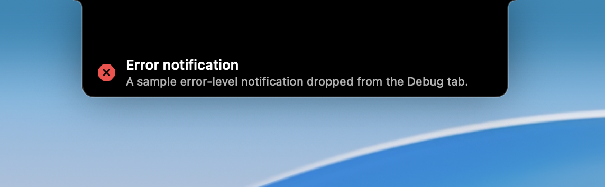
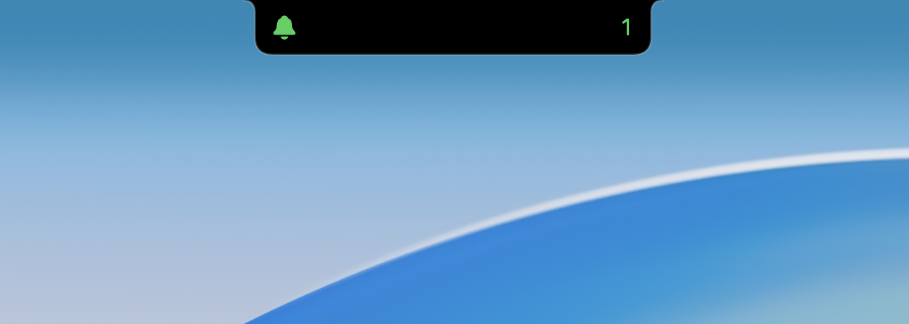
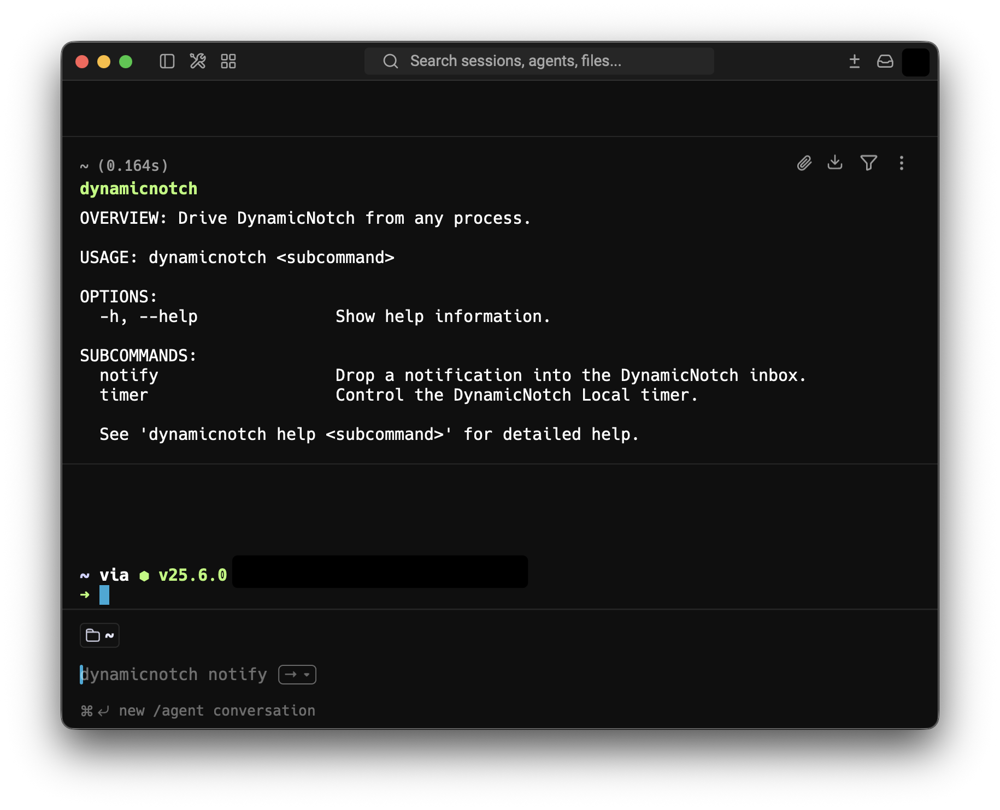
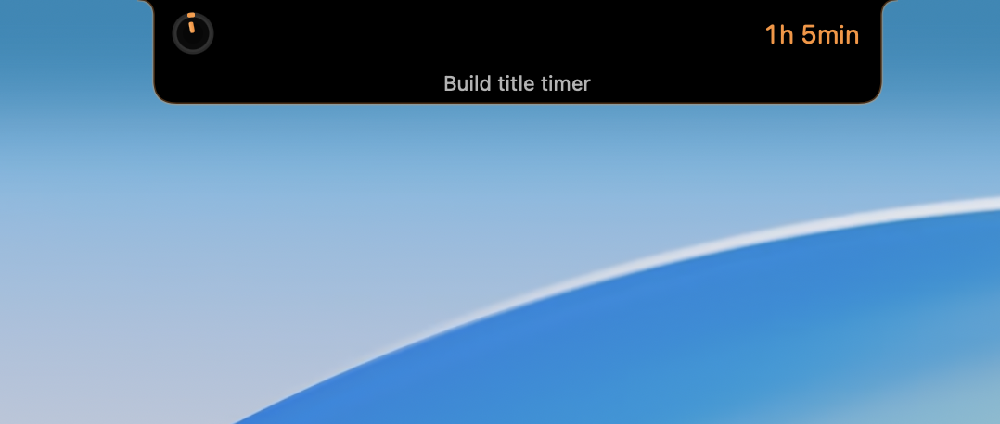

<p align="center">
  
</p>

<h1 align="center">DynamicNotch</h1>

<p align="center">
  <strong>Turn the MacBook notch into a living native surface.</strong>
</p>

<p align="center">
  DynamicNotch is a native macOS app for notched MacBooks that turns the notch into a live system surface for media,
  downloads, AirDrop, timers, screen recording, connectivity events, lock-screen transitions, and custom hardware HUDs.
</p>

<p align="center">
  <a href="https://t.me/Dynamic_Notch">
    
  </a>
  <a href="mailto:evgeniy.petrukovich@icloud.com?subject=A%20question%20about%20Dynamic%20Notch">
    
  </a>
  <a href="https://t.me/id10101101">
    
  </a>
</p>

<p align="center">
  <a href="https://github.com/jackson-storm/DynamicNotch/releases">
    
  </a>
  <a href="https://github.com/jackson-storm/DynamicNotch/releases/latest">
    
  </a>
  <a href="LICENSE">
    
  </a>
  
</p>

<p align="center">
  <a href="https://boosty.to/jacksonstormdev">
    
  </a>
  <a href="https://www.donationalerts.com/r/jacksonstormdev">
    
  </a>
</p>

<p align="center">
  
  
</p>

> ### 🍴 Fork additions (vs [jackson-storm/DynamicNotch](https://github.com/jackson-storm/DynamicNotch))

- **[Script Notifications](#-script-notifications)** — any local script can push a notification to the notch (badge + banner, severity levels).
<div align="center"></div>

- **[`dynamicnotch` CLI](#-command-line-tool)** — `notify` and `timer start`, auto-installed on `PATH`.
<div align="center"></div>

- **Local timer label** — a name shown under the countdown, set from the setup panel or the CLI.
<div align="center"></div>

## 🧐 Why DynamicNotch

The app is built with SwiftUI and AppKit, so the notch window, settings UI, and event handling feel
like part of macOS rather than a web-style overlay.

The difference between this project and others is that it is built on its own engine, and not taken from other ready-made repositories. It completely copies the logic, animations, and behavior of a real Dynamic Island on an iPhone, unlike other projects. 

The main goal is to make the project as native as possible, both in terms of design and interaction.

## 🎯 Highlights

- **Live Activities**: Now Playing (media control, album artwork, audio visualizer, customizable progress bar tint style), Downloads progress, AirDrop, Timer, Screen Recording indicator, Focus mode, Personal Hotspot, and Lock Screen media/live activity surfaces.

- **Script Notifications**: Ambient bell badge with unread counter on the notch at rest, a transient arrival banner (~3 s) for each new push, and a watched inbox folder where any local script can drop a JSON file to send a notification — each tagged with a severity level (`info` / `success` / `warning` / `error`) that colors the badge and banner.

- **Temporary Alerts**: Interactive HUD status for battery charging, low/full battery, Bluetooth connections, Wi-Fi, VPN, Focus-off toggling, and notch size modification settings feedback.

- **Gestures & Swipe Controls**: Native interactive gestures including mouse drag, trackpad swipes, vertical swipe-to-dismiss/restore with adaptive corner radii and swipe-aware blur, and horizontal trackpad/mouse scroll-to-dismiss.

- **Fluid Physics Animations**: True-to-life replication of the iOS Dynamic Island's motion design, featuring responsive physics-based spring animations, jelly-like morphing transitions, and synchronized content interpolation that matches the stretch, squash, and elastic behavior of Apple's implementation.

- **Dynamic Island (Floating Capsule)**: Automatic support for devices without a physical hardware notch (e.g. non-notched MacBooks, iMac, Mac mini, or external monitors). Transitions to a floating capsule shape (`DynamicIslandShape`) when `topInset == 0`, utilizing dynamic, smooth corner radius transitions.

- **Deep Customization**: Personalization options for base notch width/height, stroke options, background styling, animation presets, custom screen/display selection, and fullscreen spaces handling.

## 📦 Installation

1. Download the latest DMG from the [Releases](https://github.com/jackson-storm/DynamicNotch/releases) page.
2. Drag `DynamicNotch` into `Applications`.
3. Launch the app.
4. Grant the permissions needed for the features you want to use.
5. If macOS blocks the first launch, allow it from `System Settings > Privacy & Security`.

## ✅ Requirements

- macOS 14.6 or later
- Works on both notched MacBooks and non-notched displays (automatically rendering as a floating Dynamic Island capsule)
- Feature-specific permissions as needed:
  - Accessibility for custom HUD interception and some system-level interactions
  - Bluetooth access for accessory status updates
  - Screen Recording access for audio-reactive Now Playing visualization where macOS requires it
  - Media/Now Playing access where macOS requires it

## 🛠️ Build From Source

```bash
git clone https://github.com/jackson-storm/DynamicNotch.git
cd DynamicNotch
open DynamicNotch.xcodeproj
```

Then run the `DynamicNotch` scheme from Xcode. Swift Package Manager dependencies are resolved by the project.

### From the command line ([mise](https://mise.jdx.dev))

```bash
mise trust         # once per clone — mise refuses to run untrusted configs
mise install       # gum (task renderer) + node (agent tooling only)
mise run init      # check the Xcode toolchain, resolve the SPM graph
mise run dev       # rebuild Debug and relaunch the app
```

| Task | What it does |
| --- | --- |
| `mise run build` | Build the app and the CLI (Debug). `CONFIG=Release mise run build:app` for Release |
| `mise run dev` | Kill the running instance, rebuild Debug, relaunch |
| `mise run test` | Unit suite, serial, with the env-dependent geometry tests skipped |
| `mise run test:ui` | UI tests — drives the real display, opt-in |
| `mise run ci` | Verification gate: build the CLI, then run the unit suite |
| `mise run clean` | Delete the local DerivedData (`build/`) |

`mise tasks ls` lists everything. Builds use a repo-local `build/` DerivedData so
concurrent git worktrees never share state, and code signing is disabled — the
binaries are for local use, not distribution.

## 🔔 Script Notifications

DynamicNotch can receive notifications from any local script or process. When a notification
arrives, the app shows an ambient bell badge on the notch (with an unread counter tinted by the
highest-severity unread notification) plus a transient arrival banner for about 3 seconds.
Notifications are coalesced by `source` — a new notification from the same source replaces the
existing entry instead of adding a duplicate — and they persist across app restarts.

Open **Settings → Notifications** and flip the single **Notifications** toggle to activate both the
ambient badge and the Notifications page in the carousel. The badge's display priority is adjustable
under **Settings → Priorities**.

Notifications are sent with [`dynamicnotch notify`](#dynamicnotch-notify) — see the command-line
tool below.

## 🐚 Command-line tool

The **`dynamicnotch`** CLI drives the notch from any script: it pushes notifications
([`notify`](#dynamicnotch-notify)) and starts the Local timer
([`timer start`](#dynamicnotch-timer-start)). Every command builds a valid payload and delivers it
atomically, so scripts never hand-roll JSON escaping or the temp-file dance. Commands never block on
the app: the CLI drops a file into a watched folder and exits.

### Installing the CLI

DynamicNotch tries to install the CLI for you silently at every launch, so `dynamicnotch` is usually
already on your `PATH` (`/usr/local/bin/dynamicnotch`) without any action — and a moved or updated app
repairs its own link on the next launch. This silent attempt never asks for a password: if
`/usr/local/bin` isn't writable it does nothing.

To install it yourself, open **Settings → General → System** and use the **Command-line tool** row.
The button reads **Install**, **Installed** (once it's set up), or **Repair** if the link points at an
old bundle. On Apple Silicon `/usr/local/bin` is often not writable, so macOS may ask once for your
administrator password. The install is idempotent — trigger it again anytime to repair the link.

> Keep the notch from ever failing a script: guard the call so a missing binary can't trip
> `set -euo pipefail`.
>
> ```sh
> if [ -x "$(command -v dynamicnotch)" ]; then
>   dynamicnotch notify --title "Build" --summary "OK" --level success || true
> fi
> ```

### `dynamicnotch notify`

Push a [Script Notification](#-script-notifications) to the notch.

```bash
dynamicnotch notify --title "Backup nightly" \
  --summary $'42 files, 1.2 GB\nOK' --level success \
  --source backup.sh --icon externaldrive.badge.checkmark

# summary piped from stdin (e.g. the output of a job)
backup.sh 2>&1 | dynamicnotch notify --title "Backup nightly" --level success --source backup.sh
```

| Flag | Required | Description |
|------|----------|-------------|
| `--title` | **Yes** | Short heading shown in the list and arrival banner. |
| `--summary` | **Yes\*** | Full body text (multi-line supported). *\*Provide it via this flag **or** pipe it on stdin; if `--summary` is omitted the CLI reads all of stdin as the summary. Neither one → error.* |
| `--level` | No | `info` (default) · `success` · `warning` · `error` — controls badge and banner color. **Strict**: an unknown value is a usage error, never a silent downgrade. |
| `--source` | No | Coalescence key / subtitle: a new notification with the same `source` replaces the existing entry and re-marks it unread. Omit to always append. |
| `--icon` | No | SF Symbol name. Falls back to the `level` icon when the symbol is invalid or absent. |

The CLI exits `0` once the notification has been handed off, or non-zero on invalid arguments (a
missing `--title`/`--summary`, an unknown `--level`) or a write failure. It works even when the app
is closed — the notification is drained on the next launch.

#### Low-level file-drop

If the CLI is not available, any script can talk to the same inbox folder directly by writing a JSON
file into it. This is the low-level layer `notify` is built on.

Create a file with this structure and write it atomically into the inbox folder (see the one-liner
below):

```json
{
  "title":   "Backup nightly",
  "summary": "42 files, 1.2 GB\nOK",
  "level":   "success",
  "source":  "backup.sh",
  "icon":    "externaldrive.badge.checkmark"
}
```

| Field | Required | Description |
|-------|----------|-------------|
| `title` | **Yes** | Short heading shown in the list and arrival banner. |
| `summary` | **Yes** | Full body text (multi-line supported). |
| `level` | No | `info` (default) · `success` · `warning` · `error` — controls badge and banner color. |
| `source` | No | Coalescence key: a new drop with the same `source` replaces the existing entry and re-marks it unread. Omit to always append. |
| `icon` | No | SF Symbol name. Falls back to the `level` icon when the symbol is invalid or absent. |

Always write via a temp file and `mv` to avoid the app reading a partially written file.
Set `INBOX` to the path shown under **Settings → Notifications → Reveal inbox in Finder**:

```bash
INBOX="/path/from/settings"   # paste the path revealed in Settings
tmp=$(mktemp "${INBOX}/.XXXXXX.json") \
  && printf '{"title":"Backup nightly","summary":"42 files, 1.2 GB\nOK","level":"success","source":"backup.sh"}' > "$tmp" \
  && mv "$tmp" "${INBOX}/drop.json"
```

> **Note:** this one-liner writes to a fixed filename (`drop.json`), so two drops that land before
> the app ingests the first can collide and lose a notification. The `dynamicnotch` CLI avoids this
> by generating a unique filename for every invocation — prefer it under bursty load.

### `dynamicnotch timer start`

Start the **Local timer** from a script. A **Command** is not a Notification: it *acts* and
*perishes* where a Notification *informs* and *lasts*. `timer start` drops a Command into a sibling folder of the inbox
(`~/Library/Application Support/DynamicNotch/commands/`); the app starts the **Local timer** and
shows its **Label** under the countdown on the notch.

```bash
# End at an absolute instant (epoch seconds) — the timer finishes at the real time,
# whatever the ingestion lag. Ideal from a calendar/Raycast focus script.
dynamicnotch timer start --until 1712345678 --label "Fixer bug Léa"

# Or a plain duration in whole seconds (a 25-minute pomodoro).
dynamicnotch timer start --duration 1500 --label "Pomodoro"
```

| Flag | Required | Description |
|------|----------|-------------|
| `--until` | **Yes\*** | Absolute end instant: epoch seconds or ISO8601. *\*Exactly one of `--until` **or** `--duration`.* |
| `--duration` | **Yes\*** | Whole seconds from now until the timer ends. Resolved to an absolute instant **before** the drop, so the emit→ingest lag never taints the result. |
| `--label` | No | Name shown under the countdown (and in place of the word "Timer" when expanded). Blank ≡ absent. |

Rules:

- **Expiry.** `endsAt` is absolute, so a command whose end is already past is ingested and then
  **discarded without effect** — a timer arrived too late must never lie about the time left. A past
  `--until` is *not* a usage error: the CLI drops, the app decides.
- **Coalescence.** A new command **replaces** a running Local timer, so two back-to-back events
  don't fight over the surface.
- **The macOS Clock timer wins.** While a Clock (Horloge) timer runs, a `timer start` command starts
  nothing and the app pushes a `warning` Notification instead — you never face a blank notch.
- The CLI exits `0` once the file is dropped, or non-zero on an argument error (both time flags,
  neither, or a non-positive `--duration`).

## 💻 Gallery

<table align="center">
  <tr>
    <td></td>
    <td></td>
    <td></td>
  </tr>
  <tr>
    <td></td>
    <td></td>
    <td></td>
  </tr>
  <tr>
    <td></td>
    <td></td>
    <td></td>
  </tr>
  <tr>
    <td></td>
    <td></td>
    <td></td>
  </tr>
</table>

> **Note:** This gallery displays only a selection of the events, live activities, and temporary alerts supported by DynamicNotch. Many other states, animations, and system transitions are supported.

## 🧰 Tech Stack

- SwiftUI for notch content and settings UI
- AppKit for windows, input handling, and macOS integration
- Combine for feature and settings streams
- [Lottie](https://github.com/airbnb/lottie-ios) for animation assets

## 🌍 Localization

DynamicNotch features full native localization support for **38+ languages** across interface elements, notch activities, and settings. You can switch languages instantly in the app settings.

## 💖 Support

Without your support, the project will not be able to develop. If you would like to support the project, you can do so via:

### Services

- **Boosty**: [Support development or subscribe](https://boosty.to/jacksonstormdev)
- **Donation Alerts**: [One-time donation via cards or crypto](https://www.donationalerts.com/r/jacksonstormdev)

### Cryptocurrency

- **USDT (TRC-20)**: `TWYo42HQNuXSA5gmVoVV1973ScPqCtduvA`
- **USDT (ERC-20)**: `0xd3261630d7EC2484A3fcf5315f194B58834ab891`
- **Bitcoin (BTC)**: `bc1qw29074zwlp600rhvjat2v7ks53h835tthfj7dx`


## 🤝 Acknowledgements

Special thanks to the following open-source projects and services that make DynamicNotch possible:

- [Lottie for iOS](https://github.com/airbnb/lottie-ios) — for rendering premium, smooth vector animations.
- [LRCLIB](https://lrclib.net) — for providing the main engine for synchronized lyrics search.
- [Lyrics.ovh](https://lyrics.ovh) — for serving as a fallback database for static song lyrics.
- [mediaremote-adapter](https://github.com/ungive/mediaremote-adapter) — for MediaRemote API integration.

## 📄 License

DynamicNotch is released under the GNU General Public License v3.0. See [LICENSE](LICENSE) for details.
